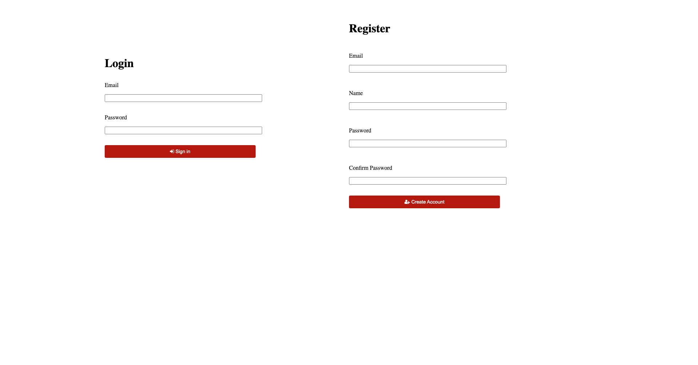
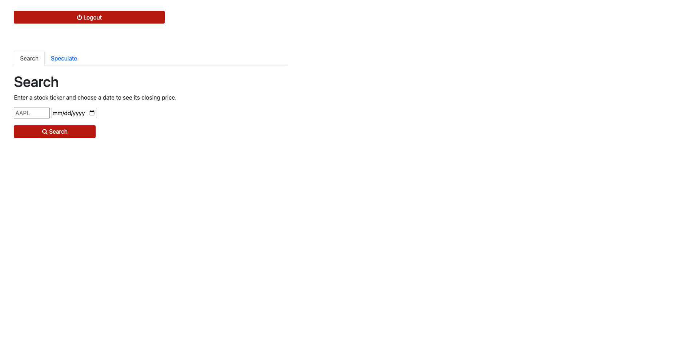
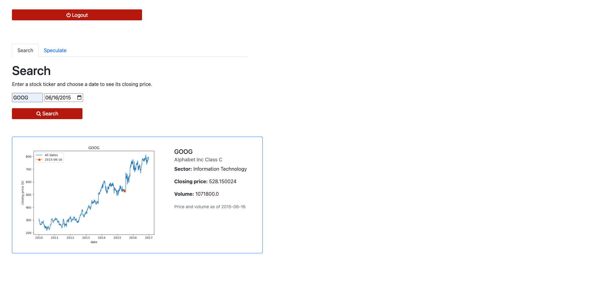

# Stockplots

## About:
**Stockplots** is a web-app where users can search for stocks and observe their price history. Users can also enter a future date to see the projected price of a stock, calculated using a linear regression model. The data is obtained from [Kaggle](https://www.kaggle.com/datasets/dgawlik/nyse), and it spans from 2010 to 2016.

## Getting Started:
1. Clone this repository.
- yfinance
- matplotlib
- scikit-learn

## Screenshots:

